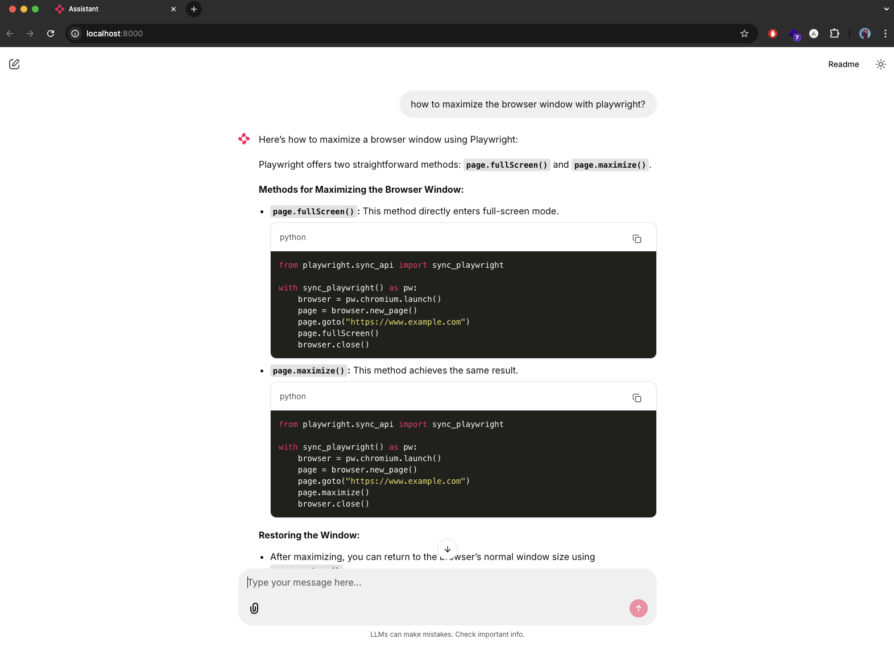

# Local Chatbot with Web UI (LangChain + Ollama + ChainLit + optional LangSmith)

**Author:** Shanaka Navaratne  
**LinkedIn:** https://www.linkedin.com/in/shanaka-qe/  

This is a **multi-model chatbot** that runs entirely on your machine using local LLMs served by Ollama. It features a modern web UI built with ChainLit for an intuitive chat experience with **dynamic model switching**. The chatbot keeps per-session chat history so the model answers with context. Optionally, you can enable LangSmith to trace and inspect your conversations for debugging/evaluation.

> 📖 **For detailed setup instructions, see [USER_GUIDE.md](USER_GUIDE.md)**

## 🌟 Key Features
- **🔄 Multi-Model Support**: Switch between different Ollama models (Llama, Gemma, Mistral, etc.) on the fly
- **💬 Conversation Memory**: Maintains context across messages for each model
- **🎨 Modern Web UI**: ChainLit-powered interface similar to ChatGPT
- **🔧 Model Management**: Automatic model discovery and testing
- **📊 Optional Tracing**: LangSmith integration for debugging

## What this project is
- A **multi-model chatbot** demonstrating how to:
  - **Use multiple local models** via Ollama (Llama, Gemma, Mistral, etc.)
  - **Switch between models dynamically** without losing conversation context
  - Build a conversational loop with LangChain's modern Runnable + Message History API
  - Maintain conversation history across turns and model switches
  - Create a modern web interface with ChainLit
  - **Compare different models** side-by-side in the same conversation
  - Optionally enable LangSmith tracing

## Quick Start

```bash
# 1. Install dependencies
pip install -r requirements.txt

# 2. Start Ollama (in separate terminal)
ollama serve

# 3. Download a model
ollama pull gemma3:4b

# 4. Run the application
chainlit run ui_app.py
```

Open your browser to `http://localhost:8000` to access the web chat interface.



### Key Features
- 🎨 Modern chat UI similar to ChatGPT
- 🔄 **Multi-Model Support**: Switch between different Ollama models on the fly
- 💬 Real-time message streaming with conversation memory
- 🔧 **Model Discovery**: Automatically finds all available Ollama models
- 📊 Optional LangSmith tracing for debugging

### Available Commands
- `clear`: Reset conversation memory
- `memory`: See conversation history
- `model info`: Display current model details
- `test model`: Test the current model connection

## 🚀 Multi-Model Workflow Example

Here's how you can leverage the multi-model capabilities:

1. **Start with one model** (e.g., `gemma3:4b` for fast responses)
2. **Ask a question** and get a response
3. **Switch to another model** (e.g., `llama3:latest` for higher quality)
4. **Ask a follow-up** - the new model sees the previous conversation
5. **Compare responses** from different models on the same topic
6. **Switch back** to the original model - context is preserved

**Use Cases:**
- **Code Generation**: Use `codellama` for coding, `llama3` for explanations
- **Speed vs Quality**: Use `gemma3:4b` for quick responses, `llama3` for complex reasoning
- **Specialized Tasks**: Switch models based on the type of question
- **Model Evaluation**: Compare how different models handle the same prompt

## How it works (high level)
- `ui_app.py`: ChainLit web interface - main entry point with LangSmith setup
- `src/llm_manager.py`: Manages Ollama models for LangChain, including model discovery and switching
- `src/chatbot.py`: Builds a chain with `RunnableWithMessageHistory` to maintain per-session history
- `config/settings.py`: Reads environment variables and default settings

## Codebase Architecture

This diagram illustrates how the different parts of the application work together.

```ascii
+--------------------------------+
|           .env File            |
| (OLLAMA_MODEL, LANGSMITH_KEY)  |
+--------------------------------+
             |
             v
+--------------------------------+
|      config/settings.py        |
| (Loads .env, provides config)  |
+--------------------------------+
             |
             v
+------------------------------------------------------------------+
|                            ui_app.py                             |
|------------------------------------------------------------------|
| - ChainLit web interface (main entry point)                      |
| - Initializes LangSmith tracing                                  |
| - Model selection dropdown                                       |
| - Session management                                             |
| - Handles UI commands (`clear`, `memory`, `model info`)          |
| - Calls `chatbot.chat(input)` for responses                     |
+------------------------------------------------------------------+
             |
             | Uses
             v
+------------------------------------------------------------------+
|                           src/chatbot.py                         |
|------------------------------------------------------------------|
| - `Chatbot` class with `RunnableWithMessageHistory`             |
| - Manages conversation history (`_memory_store`)                  |
| - Creates prompt from system message, history, and user input    |
| - Handles commands (`clear`, `memory`)                          |
| - Invokes the LLM chain                                          |
+------------------------------------------------------------------+
             |
             | Uses LLM object from
             v
+------------------------------------------------------------------+
|                         src/llm_manager.py                       |
|------------------------------------------------------------------|
| - `LLMManager` class wraps `langchain_ollama.OllamaLLM`          |
| - 🔍 Model discovery (`get_available_models()`)                  |
| - 🔄 Model switching and configuration                           |
| - 🧪 Model testing and validation                                |
| - Communicates with the Ollama server                            |
+------------------------------------------------------------------+
             |
             | HTTP API Calls
             v
+------------------------------------------------------------------+
|                          Ollama Server                           |
|------------------------------------------------------------------|
| - Runs as a separate local process                               |
| - 🚀 Serves multiple LLM models:                                |
|   • gemma3:4b (fast, efficient)                                  |
|   • llama3:latest (high quality)                                |
|   • mistral:latest (alternative)                                 |
|   • codellama:latest (code-focused)                             |
|   • + any other Ollama models you install                        |
+------------------------------------------------------------------+
```

### File Structure
```
local-chat-bot-with-ui/
├── ui_app.py              # Main entry point (ChainLit web interface)
├── src/
│   ├── chatbot.py         # Chatbot logic with conversation memory
│   └── llm_manager.py     # Ollama model management
├── config/
│   └── settings.py        # Configuration and environment variables
├── requirements.txt       # Python dependencies
├── README.md             # This file
└── chat-ui.png           # Screenshot of the web interface
```

## Troubleshooting
- **"Model not available"**: ensure `ollama serve` is running and the model exists (`ollama list`). Use the model dropdown in the UI to switch models.
- **"No models found"**: install some models with `ollama pull <model_name>` (e.g., `ollama pull gemma3:4b`)
- **"LangSmith API key not found"**: tracing is optional; add `LANGSMITH_API_KEY` to `.env` to enable.
- **Import errors**: verify your virtual environment is active and run `pip install -r requirements.txt`.
- **ChainLit UI not loading**: ensure you're running `chainlit run ui_app.py` and check that port 8000 is available.
- **ChainLit import errors**: install ChainLit with `pip install chainlit` if not already installed.
- **Conversation history not working**: ensure you're using the web interface (not terminal) and that the model supports conversation context.

## Privacy & publishing
- No secrets are hardcoded. Keep your `.env` private (already covered by `.gitignore`).
- The project runs your model locally; no prompts or responses are sent to remote LLMs unless you enable LangSmith tracing, which sends metadata to LangSmith.

## License
MIT License. Educational example. Use and modify as you like. See [LICENSE](LICENSE).
